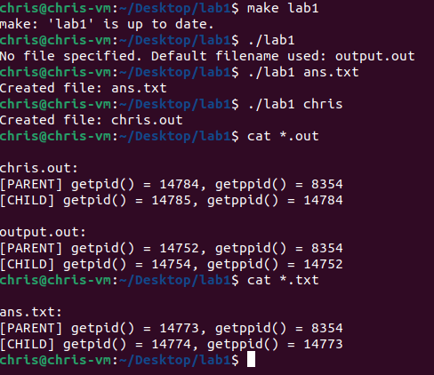

## Operating Systems -- Lab 1

# What does it do

This program initiates by creating or overwriting a file, where it first logs the executing (parent) process's PID and PPID. It then employs the fork() system call to spawn a child process, which also logs its PID and PPID to the same file. The parent process ensures its information is written first by immediately logging its details before the fork() and then waiting for the child process to complete its execution. This structured approach, along with synchronization using wait(), showcases basic process management, illustrating how parent and child processes can operate and be tracked within a Unix-like operating environment.

# How to use the executable lab1

./lab1 *name of file to output*

ex:

**./lab1 file.out**
**./lab1 hello**
**./lab1**, this creates a default file "output.out"

