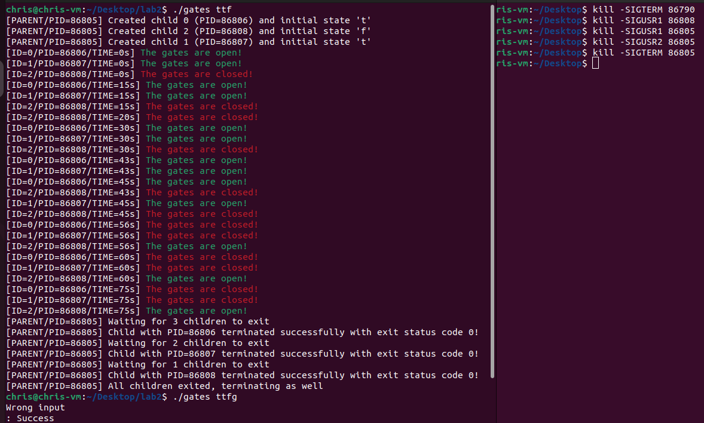

# Gates Executable Guide

## Overview

The `gates` executable is designed to demonstrate process management through the creation and manipulation of a parent process and its children. Upon execution with the argument `ttff`, it spawns four child processes.

## Running the Executable

Open a new terminal and run the following command:

```bash
./gates ttff
```

This initiates the parent process along with four children processes.

## Interacting with Processes

While `gates` is running, you can interact with the processes using the following commands in a separate terminal:

- **Display Process State**

  To display the state of a specific process or the state of all children if the PID of the parent is provided:

  ```bash
  kill -SIGUSR1 <pid>
  ```

- **Flip Process State**

  To flip the state of a process, or all children if the PID of the parent is given:

  ```bash
  kill -SIGUSR2 <pid>
  ```

- **Terminate Process**

  To kill a specific process, or the parent and all its children if the PID of the parent is given:

  ```bash
  kill -SIGTERM <pid>
  ```

## Additional Information

- The `gates` executable should be used with caution as it directly manipulates process states.
- Ensure you have the necessary permissions to send signals to the processes.

## Demonstration

Below is an illustration of `gates` in action:



Replace `lab2-1.png` with the correct path to your image file as needed.

## Conclusion

This guide covers the basic usage of the `gates` executable for educational purposes in process and signal management. For any further assistance or queries, please refer to the source code documentation or contact the development team.
