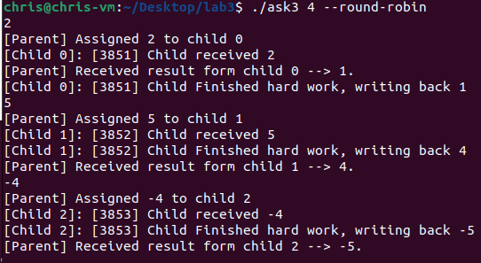

# Multi-Process Decrementer

## Overview

This C program implements a parent-child process system where the parent process creates a number of child processes. Each child process performs a simple decrement operation on an integer value it receives from the parent. The program supports interactive input, allowing users to direct tasks to child processes in a round-robin or random manner. It provides an example of inter-process communication using pipes and process control.

## Inputs

- **Number of Children (`<nChildren>`)**: Specifies the number of child processes to create.
- **Mode (`--random` or `--round-robin`)**: Optional argument to choose the scheduling strategy:
  - `--random`: Assign tasks to child processes in a random order.
  - `--round-robin`: Assign tasks to child processes in a sequential cyclic order.

## Commands

- **Integer values**: When an integer is entered, it is sent to one of the child processes to be decremented.
- **`exit`**: Terminates all child processes and closes the program.

## Outputs

- **Child Process Output**: Each child prints its ID and the received value, then the decremented value after completing the task.
- **Parent Process Output**: The parent announces the dispatch of tasks and displays the results received back from the children.

## Visual Demonstrations

- 
  - This image illustrates how the program operates in round-robin mode, distributing tasks sequentially among child processes.

- 
  - This image shows the program's behavior in random mode, where tasks are assigned to child processes in a random order.

## Errors and Handling

The program includes basic error handling for system calls like `pipe()`, `fork()`, `read()`, and `write()`. Incorrect input or system call failures will result in appropriate error messages.

## Example Usage

```bash
./program 5 --round-robin
```

This command starts the program with 5 child processes, distributing tasks in a round-robin fashion.
