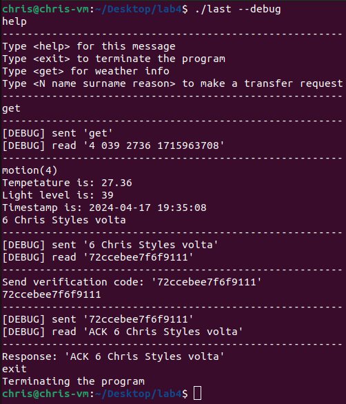

# Client-Side Socket Application README

## Overview
This C program is a client-side application for network communication via TCP/IP sockets. It connects to a specified server, sends user-inputted commands, and receives responses. The application is capable of operating in normal and debug modes, and it can be configured to connect to any server and port as specified by command-line arguments.

## Installation

To compile and run this program, you will need a C compiler (like gcc). Compile the program using the following command:

```
gcc -o client_app client.c
```

To run the compiled application:

```
./client_app [--debug] [--host HOSTNAME] [--port PORT]
```

## Usage

You can start the application with optional command-line arguments:

- --debug: Runs the application in debug mode providing detailed logs.
- --host HOSTNAME: Specifies the hostname of the server to connect to (default is "os4.iot.dslab.ds.open-cloud.xyz").
- --port PORT: Specifies the port number to connect to (default is 20241).

## Supported Commands

While the application is running, you can enter the following commands:

- help: Displays help information about available commands.
- exit: Closes the connection and exits the program.
- get: Requests weather info or other data from the server.
- N name surname reason: Sends a custom command to the server, which can be formatted as needed for different requests.

## Theoretical Background

### Sockets
Sockets provide a method for bidirectional communication over a network. In this application, we use TCP/IP sockets, which ensure that data arrives sequentially and error-free. The process involves creating a socket, connecting it to a server, and then reading/writing data.

### select() System Call
The select() system call is used to monitor multiple file descriptors, waiting until one or more of the file descriptors become ready for some kind of I/O operation. This method is particularly useful in handling multiple sources of input/output over non-blocking sockets or for implementing a timeout on socket operations.

## Example Usage

Below is a diagram showing how to use the client application with four commands:


